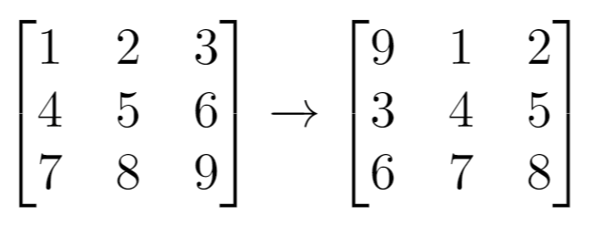
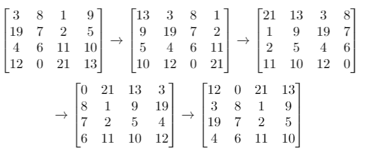
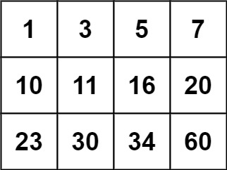

# Session 1

## General problem-solving

### Exercise 1 (Arrays and strings)

Write a method that takes a String as input and returns a boolean indicating whether or not the input string has only unique characters. If $n$ is the number of characters in the strings, can you write a method that performs this task using a number of steps which can be represented by the function $c_1 \cdot n + c_2$, where both $c_1$ and $c_2$ are constants? (i.e. can you write a method that runs in $O(n)$?)

### Questions to ask yourself

1. What are some possible inputs? What would these output? Draw out a few examples. Without thinking about how you would code it, how would you, as a human, approach the problem?
2. If having limited time and space wasn't a problem - how would you approach this problem (**brute-force approach**)? What's the simplest way you can think of?
3. What tools do you have at your disposal? Are there any data structures, algorithms, or patterns you've learned?
   - For example, an array being sorted could be a good indicator you can use binary search.
4. Are there any tricky edge cases?
5. Can you break this problem into subproblems, and solve them separately? Remember that you can always bring in helper methods. If your input is an array, could you isolate working with a single element in the array at first?

### Time and space complexity

This is based on how the algorithm's speed or space taken up changes as _the input grows_. The size of the input is indicated by $n$. For example, we could set $n$ to be the length of the string. You will learn more about asymptotic notation later in the course.

For now, all you need to know is that primitive operations (such as assigning a variable, math operations, etc) count as one step.

The number of total steps is a function of $n$. If the function for the number of steps is linear, we call this $O(n)$. For example,

```java
public static void countEveryOther(int n) {
   for (int i = 0; i < n; i += 2) {
      System.out.println(i);
   }
}
```

...has $n/2 + 1$ steps (the loop condition counts as one step). This is a linear function, so we denote it $O(n)$.

But here:

```java
public static int triangularSumSlow(int n) {
   int result = 0;
   for (int i = 1; i <= n; i++) {
      for (int j = 1; j <= i; j++) {
         result += 1;
      }
   }
   return result;
}
```

...has an outer loop that will run $n$ times. The `result += 1` step will run once in the first iteration, then twice, and in the last $n$-th iteration run $n$ times. So if you were to sum the number of times that print statement runs, you'd get $1 + 2 + ... + n$ which is $n(n+1) / 2 $, which is a quadratic function. This is why this is considered $O(n^2)$.

The space complexity similarly could depend on $n$. For example, if you wanted to create an array of $n$ slots, then you'd have $O(n)$ space complexity.

1. What is the time complexity of this program? What is the space complexity?

```java
public static int triangularSum(int n) {
    return ((n + 1) * n) / 2;
}
```

<details>
    <summary>Answer</summary>
    O(1) time and space
</details>

2. What is the time complexity of this program? What is the space complexity?

```java
public static int triangularSumDecomposition(int n) {
    int[] result = new int[n];
    for (int i = 1; i <= n.length; i++) {
        result[i] = i;
    }
    return result;
}
```

<details>
    <summary>Answer</summary>
    O(n) time and space
</details>

3. What is the time complexity of this program? What is the space complexity?

```java
public static int messyLowercaseCount(String s) {
    int[] letterCounts = new int[26];

    int i = 0, j = 0;
    while (i < n) {
        while (j < n && j <= i + 5) {
            char c = input[j];
            if (c >= 'a' && c <= 'z') {
                letterCounts[c - 'a']++;
            }
            j++;
        }
        i++;
    }
}
```

<details>
    <summary>Answer</summary>
    It's tempted to say that this is O(n^2) since we see an inner nested loop. But notice that the inner loop runs a maximum of 5 times, no matter what n is. This gives us a time complexity of O(n). We use constant space for our character array, so the space complexity is O(1).
</details>

**Key takeaway:** The number of nested loops can be misleading. Ask yourself what happen as $n$ gets very, very big. What parts of your program would require way more resources? Which parts wouldn't?

Try writing how many steps each loop in your program would take, depending on $n$. You could even use a sample input and count how many steps you need.

**Back to the problem**
We have the following brute force solution:

```java
public static boolean isUnique(String s) {
    for (int i = 0; i < s.length(); i++) {
        for (int j = i + 1; j < s.length(); j++) {
            if (s.charAt(i) == s.charAt(j)) {
                return false;
            }
        }
    }
    return true;
}
```

<details>
    <summary>Answer</summary>
    Time: O(n^2), Space: O(1)
</details>

What's the time and space complexity? Can you do better?

### Some strategies for improving time complexity

1. Use memory (such as a dictionary or array) to ensure you can access data without having to traverse an entire array.

- Remember the ASCII table - characters are represented as numeric values. If you have a small number of possible inputs (ex. only digits 0-9, or only the ASCII characters) a small integer or boolean array is a good choice as a dictionary.

2. Use multiple pointers (usually 2) that can keep track of two pieces of information at once. Often, you can keep one pointer still and move the other one depending on some information.
3. Use an algorithm (such as binary search) or another data structure (ex. stack vs. queue).

## Practice problems

These problems are related to the technical exercises (intended to help you solve them), either as similar problems or as subproblems. No solutions will be provided, but you're welcome to ask for help.

### 1D arrays

#### Problem 1

Write a method called `mergeSortedArrays()` that takes as input two sorted arrays of integers as input and merges them into a single sorted array, which is returned. Can you write a method that works in $O(m + n)$ where $m$ and $n$ are the lengths of the arrays, respectively?

```java
public static int[] mergeSortedArrays(int[] a, int[] b) {
    // code here
}

```

<details>
    <summary>Hint 1</summary>
    Use a different pointer for each of the arrays. 
</details>

<details>
    <summary>Hint 2</summary>
    At the start of each iteration, you could choose to add the value pointed to by one of the pointers, or add both of the values from both pointers to your sorted array. But is there a case where either of these approaches would fail? Consider A = [0, 1, 2] and B = [2, 5]
</details>

<details>
    <summary>Hint 3</summary>
    Now, you might choose to move either pointer A or pointer B. To make this decision, consider that you only have access to the element currently stored at pointer A, and the element currently stored at pointer B. With this limited information, what's the best move you can make?
</details>

<details>
    <summary>Hint 4</summary>
    Let's say you have A = [0, 1, 3, 4] and [2, 5, 6]. Your pointer starts at 0 in the first array, and 2 in the second. You'd put the 0 in your sorted array first. But after this, you have to decide to move either the pointer pointing to the smaller value (A) or the pointer pointing to the larger value (B). If you move the A pointer, you'd end up at 2, and would compare A[1] = 2 with B[0] = 2. But if you move the B pointer, you'd end up at 5, and be comparing A[0] = 0 with A[1] = 5. Should you move the pointer at the smaller or larger value? Why? 
</details>

#### Problem 2

Let's try an easier version of Bulls and Cows called Cows. You want to keep track of how many cows a player's guess contains.

```java
// 4 digit solution and 4 digit guess
public static int Cows(int[] solution, int[] guess) {
    // code here
}
```

<details>
    <summary>Hint 1</summary>
    Focus on a single letter for now. How would you detect if there's a "cow" in the guess?
</details>

<details>
    <summary>Hint 2</summary>
    The difficulty here is that you could have multiple cows, and multiple of the same cow (ex. '4512' and '1229'). You'd need to keep track of each cow somehow. 
</details>

<details>
    <summary>Hint 3</summary>
    Try using an integer array (or even multiple...) as a dictionary. If you could keep track of the frequency of each digit in both the guess and the solution, how could you use this information to get the number of cows?
</details>

<details>
    <summary>Hint 4</summary>
    Both frequency count dictionaries are of length 10 (which does not change depending on the size of the input). You could try creating a loop to iterate over them at the same time after counting your digits. How could this be useful?
</details>

**Extension:** For the interview problem you'd need to add bulls as well. But you want to make sure you're not double-counting your cows. There are many ways of doing this `:)`

### 2D arrays

#### Problem 1

https://leetcode.com/problems/shift-2d-grid/description/

Given a 2D grid of size m x n and an integer `k`. You need to shift the grid `k` times. Can yo do this in $O(m * n)$?

In one shift operation:

- Element at `grid[i][j]` moves to `grid[i][j + 1]`.
- Element at `grid[i][n - 1]` moves to `grid[i + 1][0]`.
- Element at `grid[m - 1][n - 1]` moves to `grid[0][0]`.

Return the 2D grid after applying shift operation `k` times.



Input: `grid = [[1,2,3],[4,5,6],[7,8,9]], k = 1`
Output:` [[9,1,2],[3,4,5],[6,7,8]]`



Input: `grid = [[3,8,1,9],[19,7,2,5],[4,6,11,10],[12,0,21,13]], k = 4`
Output: `[[12,0,21,13],[3,8,1,9],[19,7,2,5],[4,6,11,10]]`

```java
public int[][] shiftGrid(int[][] grid, int k ) {
    // code here
}
```

<details>
    <summary>Hint 1</summary>
    Rather than think about shifting the entire grid k times, try thinking about shifting each element k positions.
</details>

<details>
    <summary>Hint 2</summary>
    Can you decompose on element's shift into a row shift and a column shift? What happens if adding k would make you exceed the total number of rows or columns?
</details>

<details>
    <summary>Hint 3</summary>
    Modular arithmetic could be useful here.
</details>

<details>
    <summary>Hint 4</summary>
    For every element [i,j] in your 2D array, you need to generate a new i and new j. You could add k to your j to get the right column (modulo m). If you start at [0,0], and k = 6, then your new column position is (0 + 6) % 3 = 0. But your row is now at 2. How can you make sure you're accounting for the rightward column shifts in calculating your new row position?
</details>

#### Problem 2

https://leetcode.com/problems/search-a-2d-matrix/description/

You are given an `m x n` integer matrix `matrix` with the following two properties:

- Each row is sorted in non-decreasing order.
- The first integer of each row is greater than the last integer of the previous row.

Given an integer target, return true if target is in matrix or false otherwise.

You must write a solution in $O(log(m * n))$ time complexity.

**Note:** This is similar to Exercise 5 in the exercise list, but in Exercise 5, the rightmost value in each row is not necessarily larger than the leftmost value in the next row. 


Input: `matrix = [[1,3,5,7],[10,11,16,20],[23,30,34,60]], target = 3`
Output: `true`



Input: `matrix = [[1,3,5,7],[10,11,16,20],[23,30,34,60]], target = 13`
Output: `false`

```java
public boolean searchMatrix(int[][] matrix, int target) {
    // code here
}
```

<details>
    <summary>Hint 1</summary>
    The rows and columns are sorted. What search algorithm relies on having a sorted sequence?
</details>

<details>
    <summary>Hint 2</summary>
    You always have access to the row you're in, including the leftmost element in the row and rightmost element in that row. How could this information help you decide where to search next?
</details>

<details>
    <summary>Hint 3</summary>
    Perform a binary search with the rows, but modify the search condition. When the value at the start of the row is larger than the target element, you know to search the right half of the rows. When the value at the end of the row is smaller than the target element, you know to search the left half of the rows.
</details>

<details>
    <summary>Hint 4</summary>
    The main idea is that you first perform binary search on the rows by using the leftmost and rightmost elements in that row, then once you've narrowed down the binary search to one row, you perform binary search within the row.
</details>
