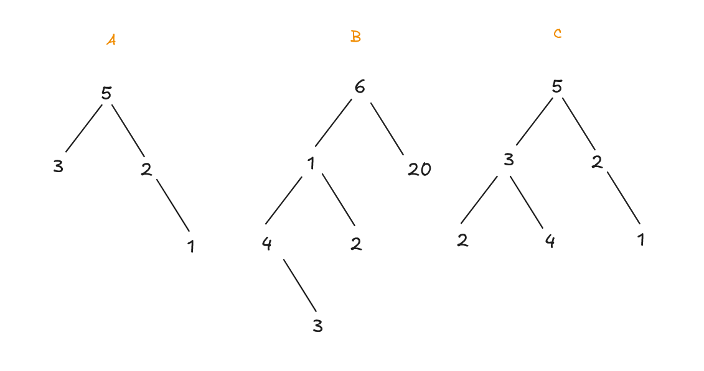
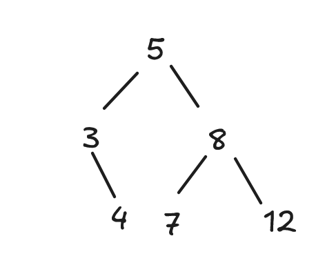

# Session 4

This session is aimed at helping you tackle the Trees portion of the interview questions. These problems are all very similar to the actual problems in the interview set, or even just intended to lead you towards a solution for an actual problem.

If you are not a Problem Solver, it will also help you if you are struggling with trees and would like walkthroughs of tree algorithms.

## Topics/skills:

- Tree traversals (BFS, DFS) and choosing which one is appropriate
- Travelling from a source node to destination node and reporting results
- Comparing trees (equality, balance, BST)
- Recursion with trees, passing down parameters
- Heaps (not covered today `:(`)

## Practice problems

### Problem 1: A level-order traversal

Print the nodes on each level of a given tree, 

```
5: 1, 4, 6  
1: 12  
4: 2  
6: 10, 8  
```

```
Output:
0: 5
1: 1 4 6
2: 12 2 10 8
```

#### Steps to go through

1. Which type of traversal seems like it would make a good "template" for our solution (DFS or BFS)? In what orders are the nodes printed?
<details>
    <summary>Answer</summary>
    5, 1, 4, 6, 12, 2, 10, 8
</details>

2. There's an iterative and recursive approach. At what point in either approach can we consider a traversal of a level "over"?

3. Step your way through the algorithm with the example tree. Then, construct your own tree and step through it with that one.

### Problem 2: Comparing trees

We say that a tree is **balanced** if for **every** node in the tree, the heights of the two subtrees do not differ by more than 1.

Design an algorithm that can will return `true` if a **binary** tree is balanced and `false` otherwise.

#### Steps to go through

1. Which one of these trees are balanced? How can you tell?



<details>
    <summary>Answer</summary>
    A, C. If you check the heights of every two subtrees of every node, they never differ by more than 1.
</details>

2. Take a look at B. What's the height of the subtree rooted at:
   a. 4
   b. 2
   c. 1
   d. 20
   e. 6

Can you see how we can get the height of the **entire** tree from the heights of the subtrees? Derive a **recursive step** to describe this.

3. Now, how can we tell if the left and right subtree differ by too much?

4. Draw another tree and step through your algorithm with it.

### Problem 3: Subexpression tree

Design an algorithm that given two expression trees determines whether one represents a subexpression of the other. A subexpression is a part of an expression that is by itself a correct expression.


#### Steps to go through

1. This is a question where your assumptions matter a lot! Make a list of questions that you could ask your interviewer.
2. Here's the list of assumptions we are going with. Be prepared for the interviewer to question how the algorithm might change if any of these were changed `;)`

<details>
    <Summary>Assumptions</Summary>
    1. We do not know ahead of time which tree might be a subexpression tree of another.
    2. Expressions which evaluate to the same number but have a different structure (i.e. `3 x 2` and `2 + 4`) are not considered the same.
    3. We can guarantee that we will receive a correct expression tree at all.
    4. Identical expression trees are subexpressions of each other.
</details>

3. What kind of information would be useful to know about the subtrees? Go back to **Problem 2** if you need a hint on what you could do next.

4. How might this problem change if you also had to validate the expression trees (i.e. you can't assume that you receive valid trees)?

### Problem 4: Binary search tree with minimal height

A **binary search tree** is a tree where for **every node** in the tree, all nodes in the left subtree are smaller than that node, and all nodes in the right subtree are larger than that node.


Notice that one of these trees has minimal height and the other doesn't.

#### Steps to go through

Let's construct a binary search tree for this array:

```
arr = [1, 3, 5, 8, 10, 16, 19, 21, 22]
```

1. Identify a good root for your binary search tree.
2. Now you need two good roots for your subtree.
3. Now you need two good roots for each subtree of your subtrees.
4. Can you see the recursive structure of this algorithm? What are the bounds of the array you should consider when constructing your two subtrees? How do you select each root of your subtree?

### Problem 5: Path sums along a tree

Consider a binary tree where each node stores an integer. Design an algorithm that takes as input an integer target and returns how many path in the tree sums up to target.


```
Input: root = [10,5,-3,3,2,null,11,3,-2,null,1], targetSum = 8
Output: 3
Explanation: The paths that sum to 8 are shown.
```

Source: https://leetcode.com/problems/path-sum-iii/description

#### Steps to go through:

1. Put yourself at node 5. What sum do we need to find in paths starting from the subtrees of 5?
2. Put yourself at node -3. What sum do we need to find in paths starting from the subtrees of -3?
3. Derive the recursive step. What target sums should we try to find in our subtrees?
4. Which type of traversal that would fit best here?
5. What's the time complexity of your solution?

**Bonus (challenging):** If we start a traversal at every single node, we might end up travelling the same paths over and over again. Is there a way to prevent this by saving the results of our traversal to some sort of dictionary? Think **memoization** (see [[Session3.md]]).

### Problem 6: (Challenging) All the arrays that led to this binary search tree

**Note**: This is a challenging problem! If you're having trouble with it, make sure you understand the solutions to these ones first:

1. Problem 26 (anagrams)
2. Problem 36 (building a binary search tree)
3. Problem 37 (validate binary search tree)
4. Problem 38 (find place of insertion in binary search tree)

Consider a binary search tree create by going through an array of integers and adding each element to the tree one by one. Design an algorithm that takes as input a reference to the root node of a binary search tree and returns a list of all the possible arrays that could have led to the construction of this tree.



```
output:
[
    [5, 3, 8, 4, 7, 12],
    [5, 3, 8, 4, 12, 7],
    [5, 3, 8, 7, 4, 12],
    [5, 3, 8, 7, 12, 4],
    [5, 3, 8, 12, 7, 4],
    [5, 3, 8, 12, 4, 7],
    [5, 8, 3, 4, 7, 12],
    [5, 8, 3, 4, 12, 7],
    [5, 8, 3, 7, 4, 12],
    [5, 8, 3, 7, 12, 4],
    [5, 8, 3, 12, 7, 4],
    [5, 8, 3, 12, 4, 7]
]

```

#### Steps to go through:

Here's the algorithm for constructing a binary search tree by traversing an array (unsorted).

```java
static Node insert(Node root, int x) {
        Node temp = new Node(x);

        // If tree is empty
        if (root == null) {
            return temp;
        }

        // Find the node who is going to have
        // the new node temp as its child
        Node parent = null;
        Node curr = root;
        while (curr != null) {
            parent = curr;
            if (curr.key > x) {
                curr = curr.left;
            } else if (curr.key < x) {
                curr = curr.right;
            } else {
                return root; // Key already exists
            }
        }

        // If x is smaller, make it left
        // child, else right child
        if (parent.key > x) {
            parent.left = temp;
        } else {
            parent.right = temp;
        }
        return root;
    }
```

Source: https://www.geeksforgeeks.org/insertion-in-binary-search-tree/

1. Step through each of the arrays in the example. Convince yourself that the binary search tree constructed from each array is the same.
2. Come up with an array that is not in the list of arrays. What does the binary search tree for that array look like?
3. Is the insertion of a node deterministic for its children? That is, in the example, why does it matter that I insert `8` before I insert `7, 12`. What would happen if I inserted `7` before `12` and `8`?
4. Recall **Problem 26**. However, in this problem, we can't generate all permutations of the array. Can you identify which sets of nodes we _can_ make permutations of? (Hint: I've ordered the arrays in the output, see if you can see a pattern).
